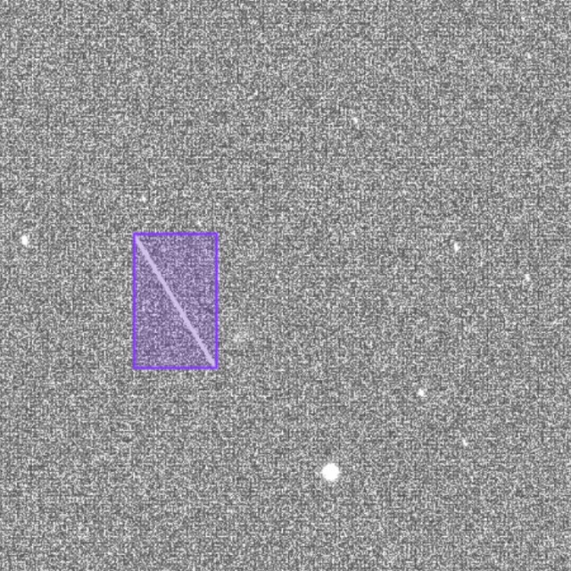

# StreaksYoloDataset

[](https://doi.org/10.5281/zenodo.14047944)

## 📖 Description

StreaksYoloDataset, is a set of raw astronomical images captured with smart telescopes and annotated with the positions of streaks that are effectively in the images. 
Images were captured between March 2022 and February 2023 from Luxembourg Greater Region by using the built-in alignment and stacking features of a Stellina smart telescope, based on an Extra Low Dispersion doublet with an aperture of 80 mm and a focal length of 400 mm (focal ratio of f/5), and equipped with a Sony IMX178 CMOS sensor with a resolution of 6.4 million pixels.

StreaksYoloDataset can be used to train YOLO detection models on raw astronomical images, enabling the detection of satellites / debris / cosmic rays with astronomical equipment accessible to the public. 




## 📜 Dataset Structure

StreaksYoloDataset is structured with the YOLO standard, i.e., with separated files for images and annotations, usable by state-of-the-art training tools and graphical software like MakeSense (https://www.makesense.ai/). 
More precisely, there is a ZIP file containing images in JPEG format (minimal compression), and text files containing the positions of streaks. 
Each image has a resolution of 640 × 640 pixels.


## 📑 Examples

The dataset was used to train a YOLOv7 model -- we will soon list here visual results. 


## 📚 Research

The dataset can be found here:

- **[2024] StreaksYoloDataset: labeled raw astronomical images for streaks detection** – [DOI Link](https://doi.org/10.5281/zenodo.14047944) 

The following studies were based on this dataset:

- **[2024] Impact of satellites streaks for observational astronomy: a study on data captured during one year from Luxembourg Greater Region** – [Link](https://www.doopyon.org/docs/publications/data2024-parisot.pdf)  
- **[2025] Resource-aware Detection of Satellites Streaks in Deep Sky Images Streams** – [Link](https://ercim-news.ercim.eu/en140/special/resource-aware-detection-of-satellites-streaks-in-deep-sky-images-streams#google_vignette)  
- **[2025] Detecting streaks in smart telescopes images with Deep Learning** – [Link](https://www.researchgate.net/publication/389335066_Detecting_streaks_in_smart_telescopes_images_with_Deep_Learning)  
- **[2025] Détection Automatique des Traînées Astronomiques avec YOLO – Une Approche Exploratoire pour la Connaissance du Domaine Spatial** – [Link](https://imt-mines-ales.hal.science/hal-05194847v1/)  


  
If you use this dataset in a publication, please notify us to include it in this list.


## 🎓 Citation

If you use **StreaksYoloDataset** in your work, please cite it as follows:

```bibtex
@dataset{parisot2024streaksyolodataset,
  author       = {Parisot, Olivier},
  title        = {StreaksYoloDataset: labeled raw astronomical images for streaks detection},
  month        = nov,
  year         = 2024,
  publisher    = {Zenodo},
  version      = {1.0.0},
  doi          = {10.5281/zenodo.14047944},
  url          = {https://doi.org/10.5281/zenodo.14047944},
}
```

## 📝 License

This dataset is released under the **CC Creative Commons Attribution 4.0 International**. 

See [`LICENSE`](https://zenodo.org/records/14047944/files/license.txt?download=1) for details.


## ✉️ Contact

For questions or collaborations, please contact **Olivier Parisot** at **olivier.parisot@list.lu** or open an issue on **GitHub**.

Copyright 2021-2025 Luxembourg Institute of Science and Technology (LIST - http://www.list.lu/).
